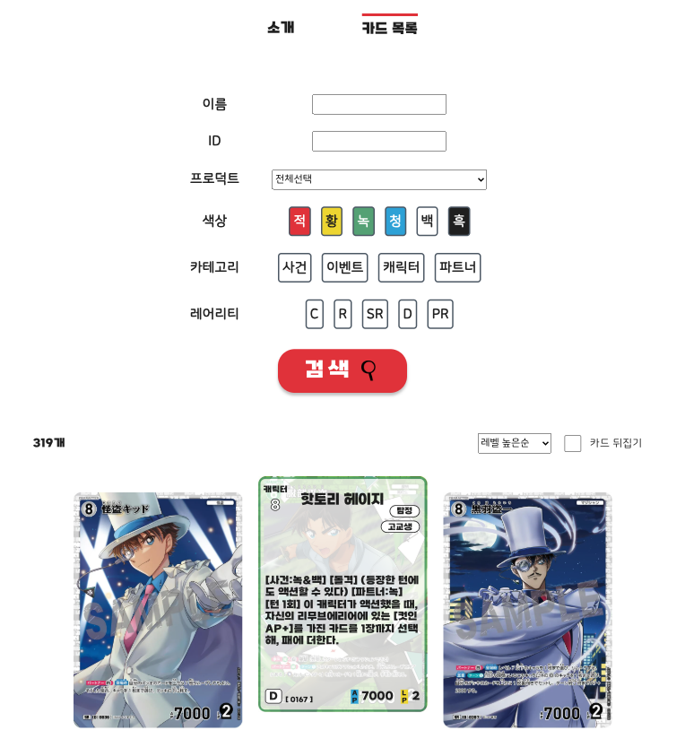
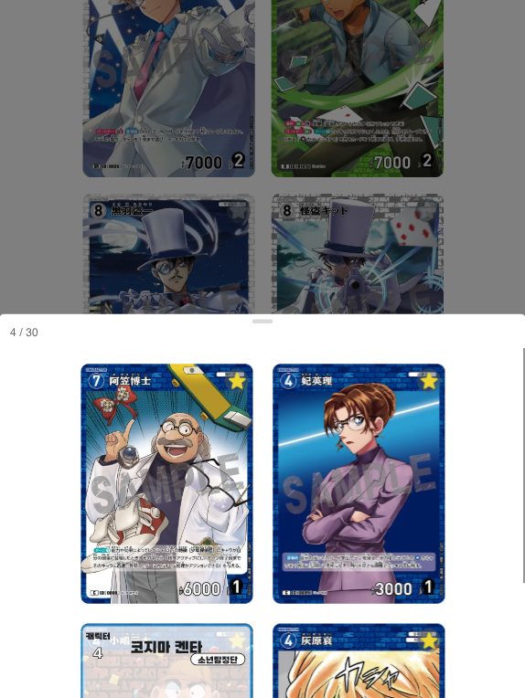

# Conan TCG DECK

<h4>한국어로 번역한 코난 카드 정보를 확인할 수 있는 웹페이지입니다.</h4>

코난 카드 게임을 위한 팬페이지이며, 카드 데이터에 대한 모든 저작권은 TOMY COMPANY에 있습니다.

## 기능

- 카드 정보 필터링
- 카드 정보 정렬
- 카드 즐겨찾기
- 카드 덱 짜기 (예정)

## 개발 과정

### Frontend

- tech stack : React.js, SCSS, styled-components, indexedDB
- 모바일 환경에서도 사용자가 정보를 확인할 수 있도록 반응형으로 구현했습니다. pc와 mobile을 구분하는 custom hook을 만들어 각 환경에 적합한 UI와 기능을 구현했습니다.
- 카드 이미지가 로딩되는 동안의 사용자 경험을 위해 이미지가 로드되기 전까지 스켈레톤 화면을 노출시켰습니다.
- 로그인 없이 사용자가 즐겨찾기한 카드 데이터를 저장하기 위해 IndexedDB를 활용했습니다.

### Backend

- tech stack : express.js, Node.js, MongoDB, Postman
- 기능에 필요한 API를 설계([명세서](https://documenter.getpostman.com/view/36801691/2sAYBYhBPW))했습니다.
- 카드 데이터의 저장을 위해서는 MongoDB Atlas를 활용했습니다.

## 기여

- 일본어 번역, 데이터 구축 : 장윤식
