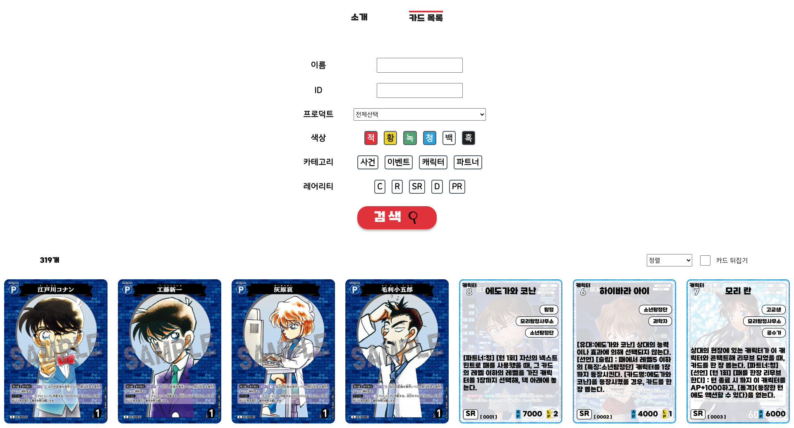
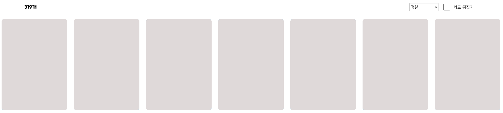

# Conan TCG DECK

코난 카드게임을 위한 팬페이지입니다. 한국어로 번역한 코난 카드 정보를 쉽게 확인 할 수 있습니다.
카드 데이터에 대한 모든 저작권은 TOMY COMPANY에 있습니다.

## 기능

1. 카드 정보 보여주기
2. 카드 정보 필터링 (이름, ID, 프로덕트명, 색상, 카테고리, 레어리티)
3. 카드 정보 레벨 높은 순으로 정렬
4. (추가 개발 예정)

## 개발 과정
React 라이브러리로 프론트엔드를 구현했습니다. 기능 추가 및 수정을 고려한 컴포넌트 설계를 했습니다. 카드 이미지들을 로딩하는데 시간이 오래걸린다는 문제가 있어 이미지가 로드되기 전까지 미리 보기를 표시하도록 구현했습니다.

백엔드 웹 서버의 경우 express 프레임워크로 구현했습니다. 카드 정보를 불러오거나 필터링, 정렬하는 API를 설계([API 명세서](https://documenter.getpostman.com/view/36801691/2sAYBYhBPW))했습니다. 카드 데이터의 저장을 위해서는 MongoDB Atlas를 사용했습니다.
